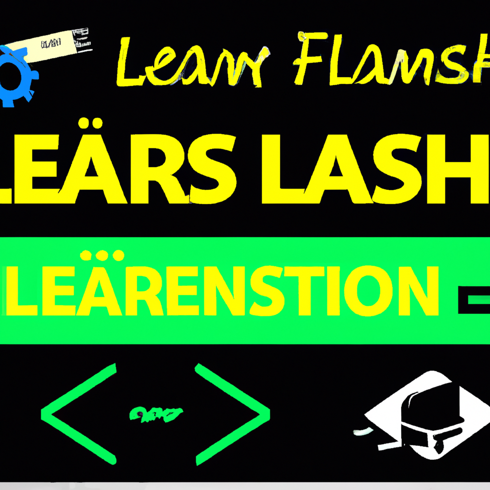

# thumbnail gen

const data = {
      model: 'dall-e-2',
      prompt: `A YouTube thumbnail for a video about ${req.body.topic}. Include visuals like ${req.body.topic === 'space' ? 'stars, planets, and astronauts' : req.body.topic} with splash text.`,
      size: '1024x1024',
    };

{
  "topic": "Generate a thumbnail for a tech review with a smartphone and the text 'Latest Smartphone Review'."
}

result:

{
  "topic": "Create a thumbnail for a coding tutorial with a computer screen and the text 'Learn JavaScript Fast'."
}

result:

# comment response gen

const data = {
      model: "gpt-3.5-turbo",
      messages: [
        { role: "system", content: "You are a helpful and optimistic AI assistant, always offering positive and thoughtful replies to YouTube comments." },        { role: "user", content: text }
      ],
      temperature: 0.7
    };

{
  "text": "bad video"
}

{
    "response": "I'm sorry to hear that you didn't enjoy the video. Everyone has different tastes, and that's totally okay! Hopefully, you'll come across something that you find more enjoyable soon. Remember, there's always something out there for everyone!"
}
